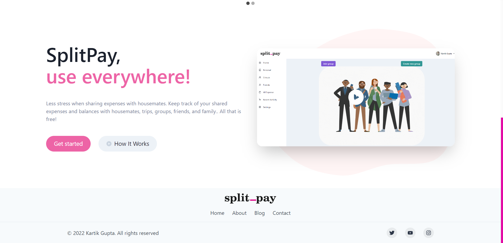
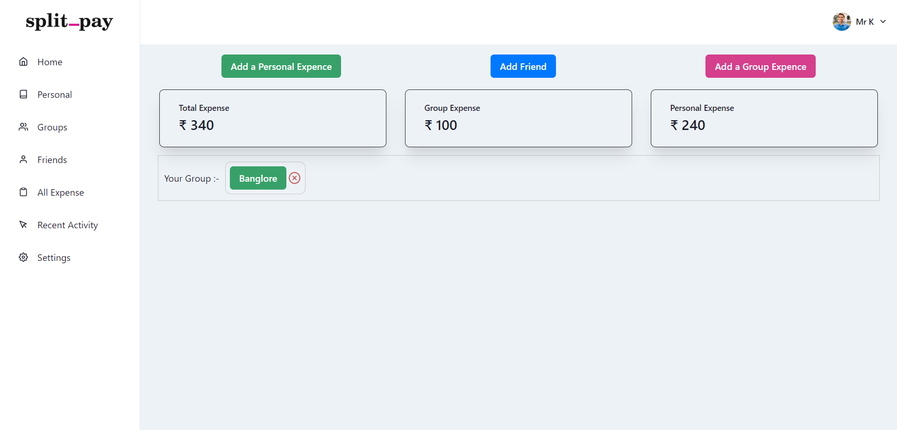
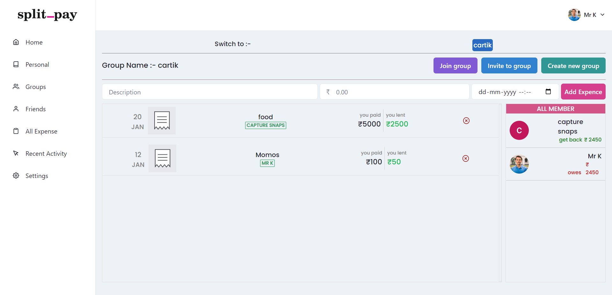
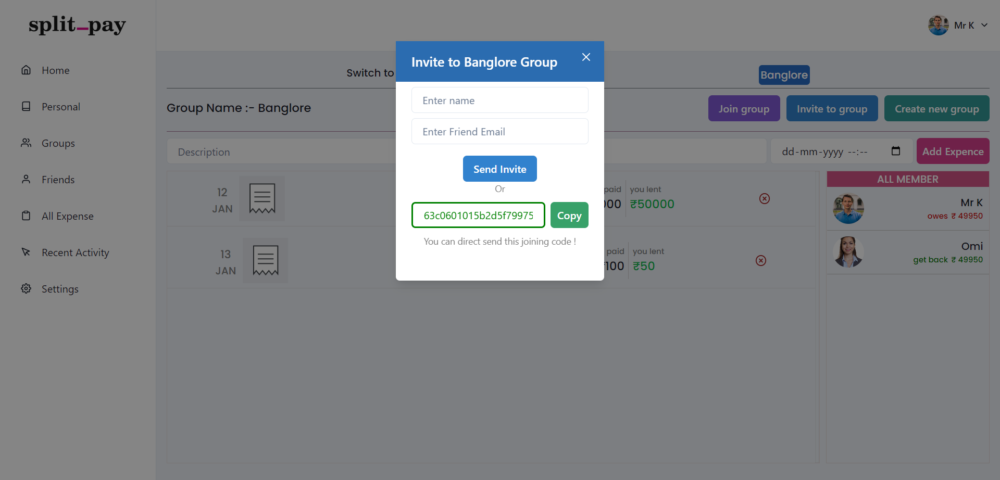
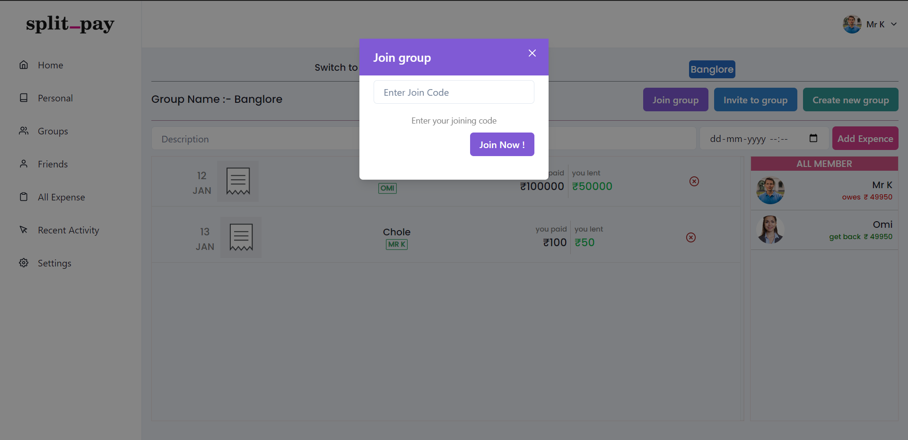
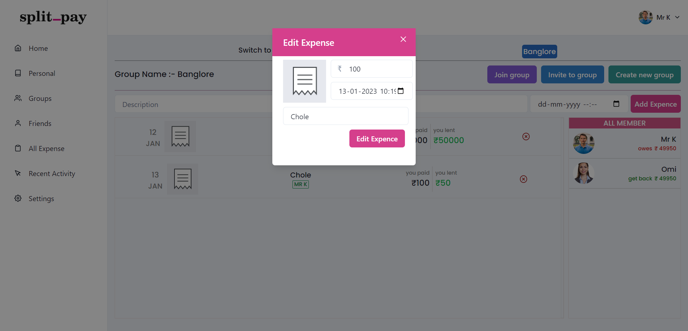

# SplitPay

<h1> Dashboard</h1>

Here you can see your All Expenses

<h1>Group</h1>

<h1>Invite</h1>

you can invite people to group by sending invitaion

<h1>Join Group</h1>

people can join group by there respective joining code

<h1>Edit and Delete</h1>

people can also edit or delete there expenses 

